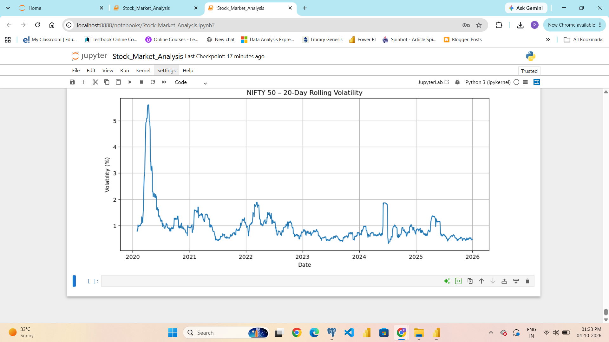

# 📈 NIFTY 50 Stock Market Analysis

## 👩‍💻 Priyanka Patel

### Data Analyst | Excel | SQL | Power BI | Python | Tableau

**NIFTY 50 Stock Market Analysis using Python, PostgreSQL, SQL and Power BI**

---
## 📌 Project Overview

This project presents an end-to-end NIFTY 50 Stock Market Analysis using historical market data from 2020 to 2025.

The project demonstrates how raw stock market data can be collected, cleaned, transformed, analyzed and converted into meaningful business insights using Python, PostgreSQL, SQL and Power BI.

The analysis focuses on:

- NIFTY 50 closing price trends
- Daily market returns
- Market volatility
- Moving averages
- Year-wise market performance
- Major daily market declines
- Long-term market movement
- Risk and market fluctuation patterns

The project follows a complete data analytics workflow:

**Raw Data → Data Cleaning → Feature Engineering → Python Analysis → PostgreSQL → SQL Analysis → Power BI Dashboard → Business Insights**

## 🎯 Business Question

How has the NIFTY 50 market performed between 2020 and 2025, and what patterns can be identified in terms of price trends, returns, moving averages and market volatility?

The project aims to answer:

- How did NIFTY 50 closing prices change over the years?
- Which years had higher average closing prices?
- What were the major daily market declines?
- How volatile was the market during different periods?
- How does the 20-day moving average help identify market trends?
- What does daily return analysis reveal about market performance?
- Which periods experienced significant market fluctuations?

## 🎯 Project Objectives

1. Analyze historical NIFTY 50 market data from 2020–2025.
2. Clean and standardize the raw datasets using Python.
3. Combine yearly datasets into a single analytical dataset.
4. Calculate important financial and statistical metrics.
5. Store the cleaned analytical data in PostgreSQL.
6. Perform SQL-based market analysis.
7. Identify major daily market declines.
8. Analyze moving averages and market volatility.
9. Build an interactive Power BI dashboard.
10. Present findings through visualizations and KPIs.
11. Demonstrate an end-to-end Data Analyst workflow.

## 📊 Dataset Description

The project uses historical NIFTY 50 market data covering:

**1 January 2020 to 31 December 2025**

The consolidated dataset contains:

- **1,492 records**
- Six years of historical market data
- Opening price
- Highest price
- Lowest price
- Closing price
- Index name
- Trading date

## 📋 Original Dataset Columns

| Column | Description |
|---|---|
| `Index Name` | Name of the market index |
| `Date` | Trading date |
| `Open` | Opening value |
| `High` | Highest value during the trading day |
| `Low` | Lowest value during the trading day |
| `Close` | Closing value |
| `source_file` | Source yearly CSV file |

## 🖥️ Dashboard Preview

 

## 📌 Key Performance Indicators

| KPI | Purpose |
|---|---|
| Average NIFTY 50 Close | Measures the average closing level |
| Highest NIFTY 50 Close | Identifies the highest recorded closing level |
| Lowest NIFTY 50 Close | Identifies the lowest recorded closing level |
| Average Daily Return % | Measures average daily market return |

## 🛠️ Tools & Technologies

- **Python** – Data cleaning, transformation, feature engineering and visualization
- **Pandas** – Data manipulation and analysis
- **NumPy** – Numerical calculations
- **Matplotlib** – Data visualization
- **PostgreSQL** – Database storage
- **SQL** – Market analysis and querying
- **Power BI** – Interactive dashboard and visualization
- **Excel** – Data analysis and reference
- **GitHub** – Project documentation and portfolio

## 🔄 Project Methodology

**Step 1:** Data Collection  
**Step 2:** Data Consolidation  
**Step 3:** Data Cleaning  
**Step 4:** Feature Engineering  
**Step 5:** Python Analysis  
**Step 6:** PostgreSQL Database  
**Step 7:** SQL Analysis  
**Step 8:** Power BI Dashboard  
**Step 9:** Business Insights  
**Step 10:** GitHub Portfolio

## 🧹 Data Cleaning & Preparation

- Imported six yearly CSV files using Pandas.
- Combined the datasets into a single dataset.
- Standardized column names.
- Converted dates into proper date format.
- Converted market price fields into numeric format.
- Checked for missing values.
- Checked data types and dataset structure.
- Sorted records chronologically.
- Prepared the final analytical dataset.

## ⚙️ Feature Engineering & Calculated Metrics

The following metrics were created:

1. **Daily Range**
2. **Daily Return %**
3. **20-Day Moving Average**
4. **50-Day Moving Average**
5. **20-Day Rolling Volatility**
6. **Cumulative Return %**

## 🐍 Python Analysis

Python was used for:

- Data cleaning
- Data consolidation
- Data transformation
- Feature engineering
- Exploratory Data Analysis
- Statistical analysis
- Data visualization

### Python Analysis Screenshot



## 🗄️ PostgreSQL Database

### Database

`stock_market_db`

### Table

`public.stock_market_data`

The PostgreSQL table contains the cleaned NIFTY 50 data along with calculated analytical metrics.

## 🧮 SQL Analysis

SQL was used to:

- Analyze market performance
- Sort daily returns
- Identify major market declines
- Perform aggregations
- Compare market performance
- Analyze historical price movements

### SQL Analysis Screenshot

 

## 📉 Major Daily Market Declines

| Date | Closing Value | Daily Return % |
|---|---:|---:|
| 23-Mar-2020 | 7,610.25 | -12.98% |
| 12-Mar-2020 | 9,590.15 | -8.30% |
| 16-Mar-2020 | 9,197.40 | -7.61% |
| 04-Jun-2024 | 21,884.50 | -5.93% |

## 📊 Power BI Dashboard

The Power BI dashboard contains:

- KPI Cards
- NIFTY 50 Close Trend
- 20-Day Moving Average
- Yearly Average Close
- 20-Day Rolling Volatility
- Average Daily Return % by Year
- Year Slicer


## 💡 Key Findings & Insights

- NIFTY 50 showed an overall upward long-term trend between 2020 and 2025.
- 2020 experienced the most prominent volatility spike.
- The largest identified daily decline was approximately **-12.98% on 23 March 2020**.
- Later years recorded considerably higher NIFTY 50 closing levels compared with the beginning of the analysis period.
- Daily returns showed significant short-term fluctuations despite the longer-term upward trend.
- The 20-day moving average provides a smoother view of short-term market direction.

 ## 📌 Recommendations

- Monitor periods of unusually high volatility.
- Analyze daily returns together with moving averages.
- Investigate extreme positive and negative market movements.
- Use year-wise comparisons to understand market evolution.
- Use interactive dashboards for faster financial data interpretation.

## 💼 Business Value

This project demonstrates the ability to:

- Work with real-world datasets
- Clean and transform data
- Perform exploratory analysis
- Build analytical metrics
- Query relational databases
- Write SQL queries
- Develop interactive dashboards
- Identify trends and anomalies
- Generate business insights
- Communicate analytical findings

## 📂 Project Structure

```text
stock-market-analysis/
│
├── Data/
│   ├── NIFTY 50_Historical_PR_01012020to31122020.csv
│   ├── NIFTY 50_Historical_PR_01012021to31122021.csv
│   ├── NIFTY 50_Historical_PR_01012022to31122022.csv
│   ├── NIFTY 50_Historical_PR_01012023to31122023.csv
│   ├── NIFTY 50_Historical_PR_01012024to31122024.csv
│   ├── NIFTY 50_Historical_PR_01012025to31122025.csv
│   └── NIFTY_50_Analysis.xlsx
│
├── Python/
│   └── Stock Market Analysis.ipynb
│
├── SQL/
│   └── Stock Market Analysis.sql
│
├── Power BI/
│   └── Stock Market Analysis.pbix
│
├── Screenshots/
│   ├── 01_PowerBI_Dashboard.png
│   ├── 02_Python_Analysis.png
│   └── 03_SQL_Analysis.png
│
└── README.mdData Analytics | Data Visualization**

## 🧠 Skills Demonstrated

### Data Analytics

- Exploratory Data Analysis
- Trend Analysis
- Time-Series Analysis
- KPI Development
- Data Visualization
- Business Insights

### Python

- Pandas
- NumPy
- Matplotlib
- Data Cleaning
- Feature Engineering

### SQL

- PostgreSQL
- Data Filtering
- Sorting
- Aggregation
- Analytical Queries

### Power BI

- KPI Cards
- Line Charts
- Column Charts
- Slicers
- Dashboard Design
- Interactive Reporting

---

## 🔄 End-to-End Workflow

**Raw Data → Python Cleaning → Feature Engineering → Python Analysis → PostgreSQL → SQL Analysis → Power BI Dashboard → Insights → GitHub Portfolio**

---

## 🏁 Project Outcome

The project successfully transformed six years of historical NIFTY 50 data into a complete analytical solution consisting of:

- Cleaned market data
- Engineered financial metrics
- Python analysis
- PostgreSQL database
- SQL analysis
- Market decline analysis
- Power BI dashboard
- Business insights
- GitHub documentation

---

## ⚠️ Data Interpretation & Limitations

- The analysis is based on historical market data.
- Historical performance does not guarantee future performance.
- The analysis focuses on the NIFTY 50 index rather than individual stocks.
- The project primarily focuses on price, returns, moving averages and volatility.
- Economic events, news sentiment and fundamental company data are not included.
- This project is intended for analytical and portfolio purposes and not as investment advice.

---

## 👩‍💻 Author

### Priyanka Patel

**Data Analyst | Excel | SQL | Power BI | Python | Tableau**

---

## 🎯 Final Project Objective

The objective of this project was to build a complete, professional and portfolio-ready NIFTY 50 Stock Market Analytics solution demonstrating practical Data Analyst capabilities from raw data collection to final dashboard and business insights.

**Python + PostgreSQL + SQL + Power BI + Excel + GitHub**

---

## 🙏 Thank You

Thank you for reviewing my **NIFTY 50 Stock Market Analysis** project.

This project demonstrates my practical application of:

**Python | SQL | PostgreSQL | Power BI | Excel | Data Analytics | Data Visualization**

I hope this project demonstrates my ability to transform raw data into meaningful insights and build complete, business-focused analytical solutions.

### ⭐ Thank You!
